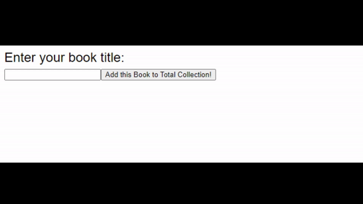

## shareknowledge

Welcome to my shareknowledge project, initially this project started for [Internet Computer Internship Bootcamp](https://www.risein.com/bootcamp-details/internet-computer-internship-bootcamp)

This project aims to facilitate the sharing of knowledge (books) among users through a decentralized web platform. The main goal is to create a transparent and accessible system for borrowing and donating books within a community.

## Project Overview

The shareknowledge Project allows users to add books to a collection and borrow books from the collection. While the project is very very new in development right now and currently does not utilize a database, it serves as a starting point for implementing a decentralized knowledge sharing platform.



## Features

- Add books to the collection: Users can add books they own to the shared collection.
- Borrow books: Users can browse the collection and borrow books from other users.
- Transparent borrowing system: The project aims to create transparency in the borrowing process, ensuring fair and accountable book-sharing practices.

## Future Improvements

Although the current version of the project is very simple, there are plans for future enhancements, including:

- Login with Internet Identity and create your own book collection with borrowed books.
- Implementing a decentralized database: Integrate a decentralized database to store book information securely.
- Token gifting system: Reward users with tokens for donating books to the collection, encouraging community participation and contribution.
- Special user role for authors which they can add the same book more than once to promote their books.
- Enhanced user experience: Improve the user interface (like a lot!) and add features for easier book discovery, borrowing and adding to the collection.
- Why limit this project with just books! In the future users could share their knowledge with blogs, images, courses and much more.

# To run this project in your computer:

If you want to start working on your project right away, you might want to try the following commands:

```bash
cd shareknowledge/
dfx help
dfx canister --help
```

## Running the project locally

If you want to test your project locally, you can use the following commands:

```bash
# Starts the replica, running in the background
dfx start --background

# Deploys your canisters to the replica and generates your candid interface
dfx deploy
```

Once the job completes, your application will be available at `http://localhost:4943?canisterId={asset_canister_id}`.

If you have made changes to your backend canister, you can generate a new candid interface with

```bash
npm run generate
```

at any time. This is recommended before starting the frontend development server, and will be run automatically any time you run `dfx deploy`.

If you are making frontend changes, you can start a development server with

```bash
npm start
```

Which will start a server at `http://localhost:8080`, proxying API requests to the replica at port 4943.

### Note on frontend environment variables

If you are hosting frontend code somewhere without using DFX, you may need to make one of the following adjustments to ensure your project does not fetch the root key in production:

- set`DFX_NETWORK` to `ic` if you are using Webpack
- use your own preferred method to replace `process.env.DFX_NETWORK` in the autogenerated declarations
  - Setting `canisters -> {asset_canister_id} -> declarations -> env_override to a string` in `dfx.json` will replace `process.env.DFX_NETWORK` with the string in the autogenerated declarations
- Write your own `createActor` constructor
